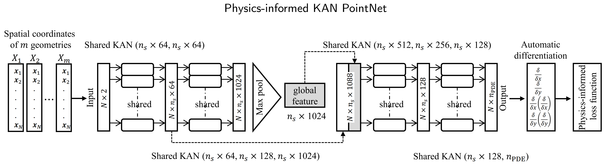
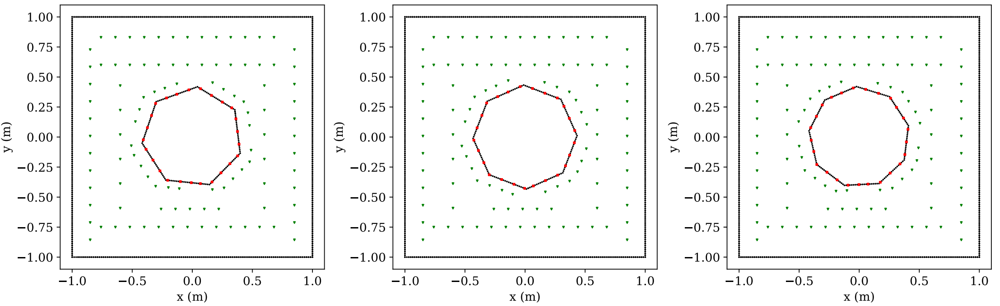
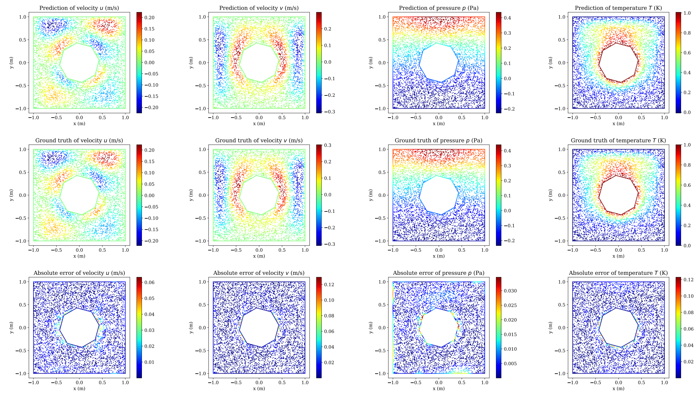

# Physics-informed KAN (Kolmogorov-Arnold) PointNet




**Physics-informed KAN PointNet: Deep learning for simultaneous solutions to inverse problems in incompressible flow on numerous irregular geometries**

**Software by:** Ali Kashefi (kashefi@stanford.edu) 

**Citation** <br>
If you use the code, please cite the following article: <br>

**[Physics-informed KAN PointNet: Deep learning for simultaneous solutions to inverse problems in incompressible flow on numerous irregular geometries](https://arxiv.org/abs/2504.06327)**

    @article{kashefi2025PhysicsInformedKANpointnet,
      title={Physics-informed KAN PointNet: Deep learning for simultaneous solutions to inverse problems in incompressible flow on numerous irregular 
      geometries},
      author={Kashefi, Ali and Mukerji, Tapan},
      journal={arXiv preprint arXiv:2504.06327},
      year={2025}}

**Abstract** <be>

Kolmogorov-Arnold Networks (KANs) have gained attention as a promising alternative to traditional multilayer perceptrons (MLPs) for deep learning applications in computational physics, particularly for solving inverse problems with sparse data, as exemplified by the physics-informed Kolmogorov-Arnold network (PIKAN). However, the capability of KANs to simultaneously solve inverse problems over multiple irregular geometries within a single training run remains unexplored. To address this gap, we introduce the physics-informed Kolmogorov-Arnold PointNet (PI-KAN-PointNet), in which shared KANs are integrated into the PointNet architecture to capture the geometric features of computational domains. The loss function comprises the squared residuals of the governing equations, computed via automatic differentiation, along with sparse observations and partially known boundary conditions. We construct shared KANs using Jacobi polynomials and investigate their performance by considering Jacobi polynomials of different degrees and types in terms of both computational cost and prediction accuracy. As a benchmark test case, we consider natural convection in a square enclosure with a cylinder, where the cylinder's shape varies across a dataset of 135 geometries. PI-KAN-PointNet offers two main advantages. First, it overcomes the limitation of current PIKANs, which are restricted to solving only a single computational domain per training run, thereby reducing computational costs. Second, when comparing the performance of PI-KAN-PointNet with that of the physics-informed PointNet using MLPs, we observe that, with approximately the same number of trainable parameters and comparable computational cost in terms of the number of epochs, training time per epoch, and memory usage, PI-KAN-PointNet yields more accurate predictions, particularly for values on unknown boundary conditions involving nonsmooth geometries.

**Installation** <be>
This guide will help you set up the environment required to run the code. Follow the steps below to install the necessary dependencies.

**Step 1: Download and Install Miniconda**

1. Visit the [Miniconda installation page](https://docs.conda.io/en/latest/miniconda.html) and download the installer that matches your operating system.
2. Follow the instructions to install Miniconda.

**Step 2: Create a Conda Environment**

After installing Miniconda, create a new environment:

```bash
conda create --name myenv python=3.8
```

Activate the environment:

```bash
conda activate myenv
```

**Step 3: Install PyTorch**

Install PyTorch with CUDA 11.8 support:

```bash
pip3 install torch torchvision torchaudio --index-url https://download.pytorch.org/whl/cu118
```

**Step 4: Install Additional Dependencies**

Install the required Python libraries:

```bash
pip3 install numpy matplotlib torchsummary
```

**Step 5: Download the Data** <be>

Use the following batch command to download the dataset (a NumPy array, approximately 42MB in size).

```bash
wget https://web.stanford.edu/~kashefi/data/HeatTransferData.npy
```

**Questions?** <br>
If you have any questions or need assistance, please do not hesitate to contact Ali Kashefi (kashefi@stanford.edu) via email. 

**About the Author** <br>
Please see the author's website: [Ali Kashefi](https://web.stanford.edu/~kashefi/) 

